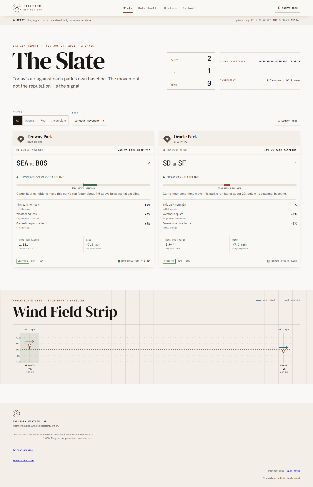
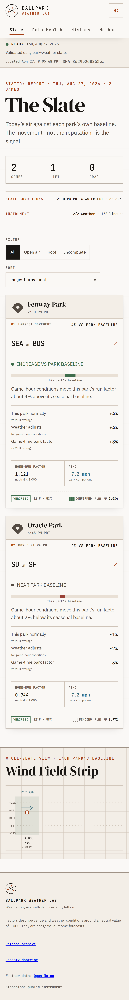
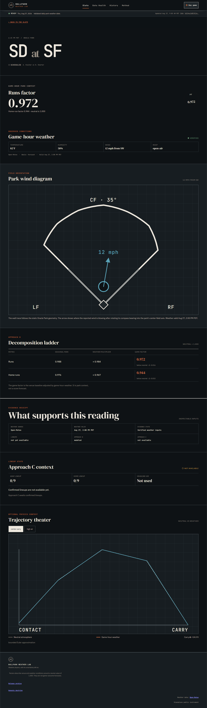

# Ballpark Weather Lab

Ballpark Weather Lab is a standalone portfolio project that turns an MLB slate, game-hour
weather, and versioned model artifacts into an inspectable park-factor publication. The product
is deliberately narrow: it explains how venue and weather context move runs and home-run park
factors around a neutral value of `1.000`. It does not forecast winners, scores, or financial
outcomes.

**Repository:** [github.com/ballinprestige/ballpark-weather-lab](https://github.com/ballinprestige/ballpark-weather-lab)

**Live demo:** [ballinprestige.github.io/ballpark-weather-lab](https://ballinprestige.github.io/ballpark-weather-lab/)

**Recorded August 28 reliability-repair proof:** `2026-08-28` · 15 games · SHA-256 `f96bf07b8f033227a4226519830cd391760e1782a59328c7fe79b59299b33f62` · [workflow receipt](https://github.com/ballinprestige/ballpark-weather-lab/actions/runs/33223744721)

**Daily reliability status:** **PROVISIONAL — 2/7.** The first two scheduled events were
delivered by GitHub roughly nine hours late. Both eventually passed, but a successful recovery is
not proof of a dependable daily service. The application must accumulate seven consecutive,
same-day, hash-matched public archive receipts and retain their hosted public-readback evidence
before that claim is made. If the displayed slate falls behind the current `America/New_York`
date, the interface replaces `READY` with a visible `STALE` warning.

The public interface is designed as an evidence trail rather than a black box. Each release shows
its generation time, data-health state, payload hash, source timestamps, weather decomposition,
park wind diagram, trajectory illustration, and historical snapshots.

## Employer demo preview

The screenshots below come from the deterministic, schema-valid normal-slate fixture and the same
production build used by the browser tests. The interface preserves the original editorial field-
instrument language: warm paper, burnt-orange signal, wind-only cyan, park cards, Ledger mode,
Wind Field Strip, and dedicated game stations.







## The daily critical path

1. Fetch the selected date's MLB schedule.
2. Attach bounded, game-hour Open-Meteo weather requests.
3. Evaluate the existing Approach B XGBoost runs and home-run park-factor models.
4. Add Approach C lineup/trajectory context only when official lineups, weather, and optional
   artifacts are all available. Approach C is experimental and never supplies the headline.
5. Validate one payload, write versioned release files, build the Svelte frontend, deploy one
   GitHub Pages artifact, and read back the public date and exact SHA-256.

Missing weather is shown as a per-game hold with seasonal baselines; it is never presented as a
fresh modeled result. Missing lineups do not block Approach B. A missing schedule, duplicate game
ID, invalid payload, or damaged critical model artifact stops publication.

See [the architecture](docs/architecture.md) for the full state and trust boundaries.

## One-command daily operation

After the one-time installation below, the complete local daily operation is:

```bash
python -m ballpark daily
```

The default slate date is the current date in `America/New_York`. To make a run reproducible:

```bash
python -m ballpark daily --date 2026-08-26 --fixture tests/fixtures/normal_slate.json \
  --generated-at 2026-08-26T12:00:00Z
```

The command validates model artifacts, builds and validates the payload, publishes into
`web/public`, builds the frontend, and verifies that `web/dist/data/data.json` matches its release
receipt. Detailed setup and recovery steps are in [operations](docs/operations.md).

## Install once

Requirements are Python 3.12 or newer and Node.js 22.x.

```bash
python -m venv .venv
python -m pip install --require-hashes --requirement requirements.lock
python -m pip install --no-build-isolation --no-deps --editable .
npm ci --prefix web
```

Activate the virtual environment using the normal command for your platform before running the
remaining commands.

## Verify locally

```bash
python -m pytest
python -m ballpark verify-artifacts
npm run verify --prefix web
npm run test:e2e --prefix web
```

The test surface covers a normal slate, a valid no-slate day, missing weather, missing lineups,
malformed optional and critical artifacts, duplicate game IDs, atomic file replacement, bounded
network behavior, payload schema enforcement, public date/hash readback, and desktop/mobile demo
paths. The distinction between implemented tests, historical repair evidence, and current public
proof is recorded in [verification](docs/verification.md).

## Model evidence, stated precisely

Approach B contains two XGBoost regression artifacts trained to estimate weather multipliers for
runs and home-run park factors. The published evidence receipt describes 21,608 total game rows:

| Split | Rows | Purpose |
| --- | ---: | --- |
| Fit | 17,075 | Model fitting and early-stopping training input |
| 2024 validation | 2,302 | Model selection and early stopping |
| 2025 held-out test | 2,231 | One temporal holdout evaluation |

| Target multiplier | Validation RMSE | Held-out RMSE |
| --- | ---: | ---: |
| Runs | 0.4816 | 0.5102 |
| Home runs | 0.6833 | 0.7173 |

RMSE is expressed in the model's per-game multiplier target units. These values describe one
historical experiment. The repository does not provide a baseline comparison, uncertainty
interval, prospective evaluation, or evidence of outcome or financial performance. See the
[model card](MODEL_CARD.md) and [limitations](LIMITATIONS.md).

Approach C contains 839 derived batter profiles, a 3,018,625-row generated trajectory lookup, and
30 stadium geometries. It is a transparent geometry experiment, remains visibly labeled as such,
and is never used in the headline factor.

## Historical repair evidence

These observations come from isolated live smoke runs of the pre-publication standalone builder.
They are useful incident evidence, but they are not current GitHub Pages verification:

- On August 26, 2026, the isolated builder completed all 15 scheduled games with confirmed
  lineups while external publication was disabled.
- On August 27, 2026, it completed all seven scheduled games with valid weather before official
  lineups were available, preserving the Approach B slate and reporting the optional context as
  unavailable.

The [incident and repair case study](docs/incident-repair-case-study.md) explains why a functional
builder had previously produced a stale public surface and how the dependency graph was reduced.

## Hosted operation

The Pages workflow has staggered daily opportunities at `15:17`, `19:43`, and `23:37 UTC`; the
last is a same-day refresh for official lineups and optional Approach C. It can also be dispatched
for an explicit date. GitHub schedules are best-effort, so a cron entry is not itself freshness
evidence: the final job must read back the public date and exact payload hash. The workflow uses
GitHub's Pages deployment identity with only `contents: read`, `pages: write`, and
`id-token: write` where needed. It does not use a desktop token or repository secret for Pages.
Concurrency prevents overlapping deployments, and source requests use bounded retries and
timeouts.

The first hosted release completed its code, artifact, unit, desktop/mobile browser, Pages, and
public readback gates. The deployed `2026-08-27` payload was fetched independently and matched its
release receipt byte-for-byte; durable details are recorded in [verification](docs/verification.md).

The evidence verifier currently confirms `2/7` consecutive same-day archive-generation receipts
ending on August 28. It validates each archived payload's full contract, SHA-256, and New York
generation date. The linked hosted readbacks remain separate evidence, and the service claim stays
provisional until both evidence sets cover all seven dates:

```bash
python -m ballpark verify-reliability \
  --url "https://ballinprestige.github.io/ballpark-weather-lab/" \
  --ending-date 2026-08-28
```

## Documentation

- [Architecture](docs/architecture.md)
- [Operations](docs/operations.md)
- [Verification matrix](docs/verification.md)
- [Data sources and artifact policy](DATA_SOURCES.md)
- [Third-party notices](THIRD_PARTY_NOTICES.md)
- [Model card](MODEL_CARD.md)
- [Limitations](LIMITATIONS.md)
- [Security policy](SECURITY.md)
- [Threat and sanitization report](docs/security-sanitization-report.md)
- [Incident and repair case study](docs/incident-repair-case-study.md)
- [Preview publication decision](docs/operator-decision-preview.md)
- [Three-minute employer walkthrough](docs/employer-walkthrough.md)
- [Resume-ready evidence](docs/resume-evidence.md)

## License and affiliation

This repository is publicly inspectable but is **not open source**. No reuse license is granted;
see [LICENSE.md](LICENSE.md). Third-party data, names, marks, and dependencies remain subject to
their own terms. This project is independent and is not endorsed by MLB, its clubs, data
providers, or venue operators.
