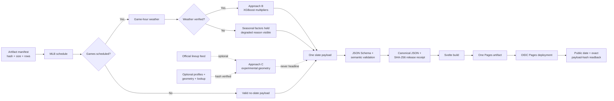

# Architecture

Ballpark Weather Lab is one daily Python build and one static Svelte application. Its architecture
keeps required park-weather work separate from optional lineup/trajectory context and from hosted
deployment.

## Critical path

## Components

| Component | Responsibility |
| --- | --- |
| `src/ballpark/schedule.py` | Fetch and project the selected MLB schedule; reject unsupported venues, cross-date rows, and duplicate IDs. |
| `src/ballpark/weather.py` | Select game-hour Open-Meteo weather, decompose wind relative to center field, and emit explicit degraded or indoor states. |
| `src/ballpark/model.py` | Load Approach B artifacts and apply clipped weather multipliers to seasonal venue baselines. |
| `src/ballpark/lineups.py` | Observe whether both official batting orders are available; this adapter is optional. |
| `src/ballpark/physics.py` | Provide optional Approach C lineup geometry and illustrative trajectory arcs. |
| `src/ballpark/artifacts.py` | Enforce the artifact inventory, critical hashes/sizes, optional row counts, and published evidence counts. |
| `src/ballpark/contract.py` | Validate JSON Schema plus cross-field rules such as one date and unique game IDs. |
| `src/ballpark/publication.py` | Canonicalize bytes, write per-file atomic replacements, maintain history, and verify public date/hash equality. |
| `src/ballpark/pipeline.py` | Orchestrate the bounded daily graph and its honest degraded states. |
| `web/` | Validate and render the static slate, Data Health, History, and Method views. |
| `.github/workflows/pages.yml` | Test, build, deploy one Pages artifact, and perform public readback. |

## Required and optional boundaries

Approach B is the only modeled headline. It requires the schedule, critical artifact inventory,
venue registry, and verified game-hour weather for each modeled game. If weather is unavailable,
that game remains in the slate with its seasonal baselines and a visible hold.

Approach C requires both confirmed nine-player batting orders, verified weather, and three optional
artifact families. A missing or malformed Approach C artifact changes the artifact lane to
`partial` and Approach C to `not_available`; it does not suppress Approach B.

| Condition | Publication behavior |
| --- | --- |
| Required schedule cannot be fetched or parsed | Stop; do not replace the previous publication. |
| MLB reports zero games | Publish `no_slate` with an empty games array. |
| One game's weather cannot be verified | Publish `degraded`; show seasonal factors and hold that game's weather adjustment. |
| Lineups are pending, partial, or unavailable | Publish Approach B; mark Approach C unavailable. |
| Optional Approach C artifact is missing or malformed | Publish Approach B; record artifact warning and disable Approach C. |
| Critical model/baseline/display artifact fails verification | Stop before publication. |
| Duplicate game ID, cross-date row, or invalid payload | Stop before publication. |

## Bounded network behavior

The shared HTTP client uses a 3-second connect timeout, 8-second read timeout, and two total
attempts for idempotent GET requests. It honors `Retry-After` and retries selected transient HTTP
statuses. The daily per-game loop also has a 180-second network deadline. These are operational
bounds, not an availability guarantee.

## Payload and release contract

The pipeline validates one `schema_version: 1` payload. Publication serializes sorted, compact
UTF-8 JSON with a terminating newline and computes its SHA-256. Four release files are maintained:

- `data/data.json` — current payload.
- `data/release.json` — current date, generation time, status, game count, and payload hash.
- `archive/YYYY-MM-DD.json` — immutable-by-convention dated payload.
- `archive/index.json` — sorted, date-deduplicated history receipts.

Local replacement is atomic per file. The multi-file directory is not a transactional database.
GitHub Pages subsequently promotes `web/dist` as one deployment artifact.

Before a hosted build, up to 120 prior public dates can be restored. Each date must be canonical,
and each archive's exact bytes must match the prior index hash. Failure to retrieve history is
non-blocking; a malformed accepted history record is not silently trusted.

## Hosted trust boundary

The build job has `contents: read`. The separate deploy job adds `pages: write` and
`id-token: write` for GitHub's Pages identity. There is no workstation token or static Pages
credential. A concurrency group prevents overlapping deployments.

After deployment, the verifier cache-busts and fetches both `data/release.json` and
`data/data.json`. Success requires the expected date, the expected receipt hash, and the hash of
the actual public payload bytes to agree within bounded attempts.

## Frontend evidence path

The browser validates release and payload shape before display. It provides four primary views:

- **Slate:** master/detail matchups with factor headline and source receipts.
- **Data Health:** generation time, payload hash, schedule/weather/lineup/artifact lanes, and
  per-game coverage.
- **History:** hash-checked archived payloads and a return-to-current path.
- **Method:** the critical path, split counts, RMSE receipt, and limitations.

The detailed game view includes game-hour conditions, park wind diagram, decomposition ladder,
experimental Approach C state, and illustrative trajectory theater.
